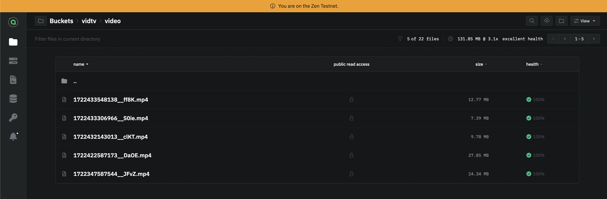

# Renterd Service Documentation

## Overview

VidTv is a web app that uses the Sia Decentralized Storage Blockchain to stream and manage all its media files.

## Prerequisites

The Renterd service comprises of the following technologies:

- Sia Renterd
- Docker

#### Installation Guide

This step require that you already have Docker installed. Run the command below to launch Renterd testnet on your Docker environment.

**1. Clone the project:**
`$ git clone https://github.com/Daltonic/sia_vid_tv`

**2. Add Environment Variables:**
Create an environment variable (`.env`) in the _root_ of this project and supply the following information:

- `RENTERD_SEED=<YOUR_SEED_PHRASE>`: A twelve words pass phrase to generate your public key.
- `RENTERD_API_PASSWORD=<YOUR_LOGIN_PASSWORD>`: A secret characters for logging into renterd node.

**3. Launch Renterd in Docker:**
`$ docker compose -f "docker-compose.yml" up -d --build`

**4. Visit with browser:**
Head to `http://localhost:9880` and login with your `RENTERD_API_PASSWORD`.

**5. Renterd Setup Guide:**
Follow [this tutorial get your Rentered ready](/) to start managing your files on the blockchain.

#### Backend Setup

Follow the instructions here to [setup your backend](/backend/) which is built with Express and TypeScript.

#### Frontend Setup

Follow the instructions here to [setup your frontend](/frontend/) which is built with NextJs 14 and TypeScript.

Questions about running the demo? [Open an issue](https://github.com/Daltonic/sia_vid_tv/issues). We're here to help, [Learn how we built this dApp here on YouTube](https://www.youtube.com/playlist?list=PLUDcVqFK2t-CZJZ5ihfrVHtLkDhZlLYO-).

#### Useful links

- 🏠 [Sia Website](https://sia.tech)
- 🔥 [Sia Renterd](https://sia.tech/software/renterd)
- 👨‍💻 [Sia Renterd API](https://api.sia.tech/renterd)
- 🚀 [Sia Discord Channel](https://sia.tech/discord)
- 💡 [Our Website](https://dappmentors.org/)
- 💪 [YouTube Channel](https://youtube.com/@dappmentors)