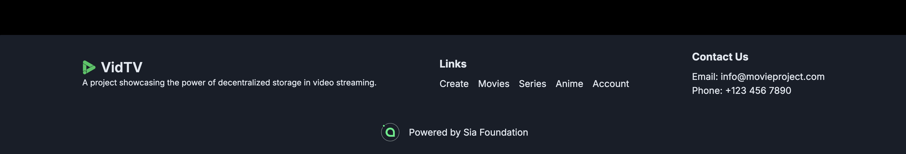

# VidTv Backend Documentation




## Overview

VidTv is a web app that uses the Sia Decentralized Storage Blockchain to stream and manage all its media files. 

## Prerequisites
The backend comprises of the following technologies:
- NodeJs
- TypeScript

#### Installation Guide
Run the command below to start your backend service.

**1. Backend Setup:**
```sh
$ cd backend
$ npm install
```

**2. Add Environment Variables:**
Create an environment variable (`.env`) in the _root_ of this project and supply the following information:

- `SIA_API_BUCKET=<YOUR_RENTERD_BUCKET_NAME>`: The name of the Sia bucket where files will be stored.
- `SIA_API_PASSWORD=<YOUR_RENTERD_PASS>`: The API password required to authenticate with the Sia service.
- `SIA_API_BASE_URL=<YOUR_RENTERD_API_URL>`: The base URL of the Sia service API.
- `ORIGIN=<CURRENT_BACKEND_URL>`: The origin URL that will be used to construct the download URLs for files.
- `PORT=<PORT_NUMBER>`: Port 9000 is recommended.

**3. Run the Frontend:**
`$ npx run build && npx run start`

**4. Visit with browser:**
Head to `http://localhost:9000` to on the browser for confirmation. Ensure your backend service is up before running the frontend.

**5. Renterd Setup Guide:**
Follow [this tutorial get your Rentered ready](../) to start managing your files on the blockchain.

#### Frontend Setup
Follow the instructions here to [setup your frontend](/frontend/) which is built with NextJs 14 and TypeScript.

Questions about running the demo? [Open an issue](https://github.com/Daltonic/sia_vid_tv/issues). We're here to help, [Learn how we built this dApp here on YouTube](https://www.youtube.com/playlist?list=PLUDcVqFK2t-CZJZ5ihfrVHtLkDhZlLYO-).

#### Useful links

- 🏠 [Sia Website](https://sia.tech)
- 🔥 [Sia Renterd](https://sia.tech/software/renterd)
- 👨‍💻 [Sia Renterd API](https://api.sia.tech/renterd)
- 🚀 [Sia Discord Channel](https://sia.tech/discord)
- 💡 [Our Website](https://dappmentors.org/)
- 💪 [YouTube Channel](https://youtube.com/@dappmentors)