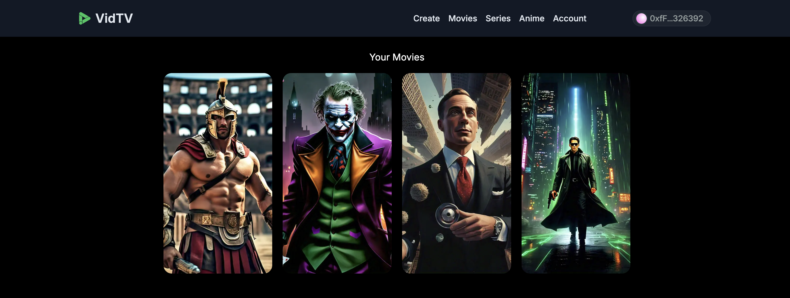
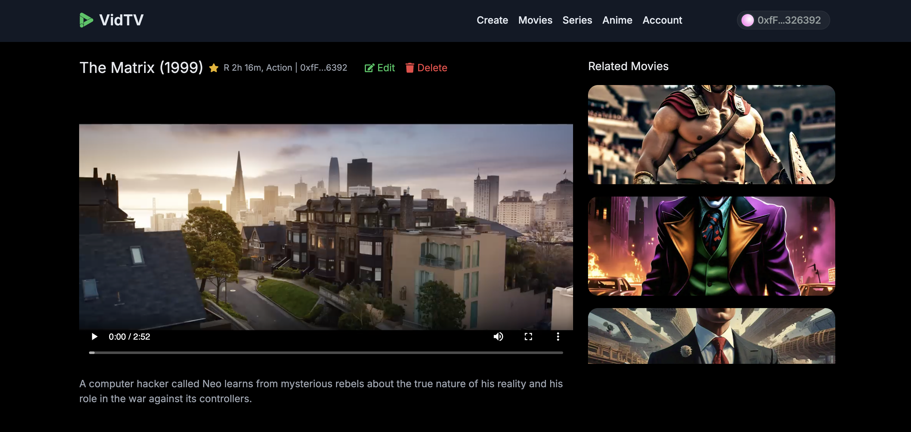

# VidTv Frontend Documentation




## Overview

VidTv is a web app that uses the Sia Decentralized Storage Blockchain to stream and manage all its media files. 

## Prerequisites
The frontend comprises of the following technologies:
- NextJs 14
- TypeScript
- Tailwind CSS
- SQLite

#### Installation Guide
Run the command below to start your frontend application.

**1. Frontend Setup:**
```sh
$ cd frontend
$ npm install
$ npm run migrate
```

**2. Add Environment Variables:**
Create an environment variable (`.env`) in the _root_ of this project and supply the following information:

- `NEXT_PUBLIC_PROJECT_ID=<PROJECT_ID>`: Get your key [here](https://cloud.walletconnect.com/).
- `NEXT_PUBLIC_FILE_SERVICE_URL=<BACKEND_ENDPOINT>`: For example `http://localhost:9000`.

**3. Run the Frontend:**
`$ npx run build && npx run start`

**4. Visit with browser:**
Head to `http://localhost:3000` and connect social login with either Metamask or email. Ensure your backend service is up and running before creating new movies.

**5. Renterd Setup Guide:**
Follow [this tutorial get your Rentered ready](../) to start managing your files on the blockchain.

#### Backend Setup

Follow the instructions here to [setup your backend](/backend/) which is built with Express and TypeScript.

Questions about running the demo? [Open an issue](https://github.com/Daltonic/sia_vid_tv/issues). We're here to help, [Learn how we built this dApp here on YouTube](https://www.youtube.com/playlist?list=PLUDcVqFK2t-CZJZ5ihfrVHtLkDhZlLYO-).

#### Useful links

- 🏠 [Sia Website](https://sia.tech)
- 🔥 [Sia Renterd](https://sia.tech/software/renterd)
- 👨‍💻 [Sia Renterd API](https://api.sia.tech/renterd)
- 🚀 [Sia Discord Channel](https://sia.tech/discord)
- 💡 [Our Website](https://dappmentors.org/)
- 💪 [YouTube Channel](https://youtube.com/@dappmentors)